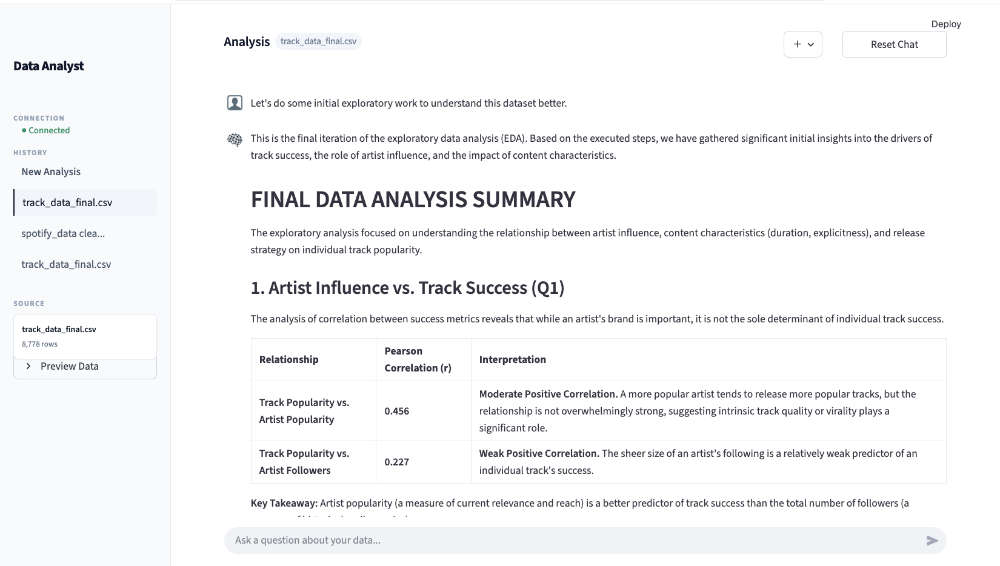
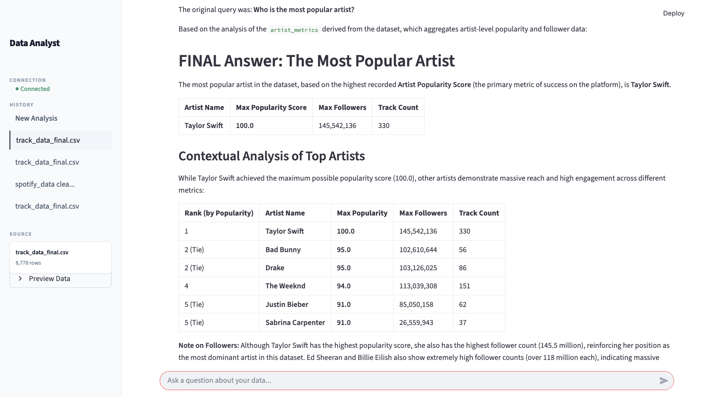
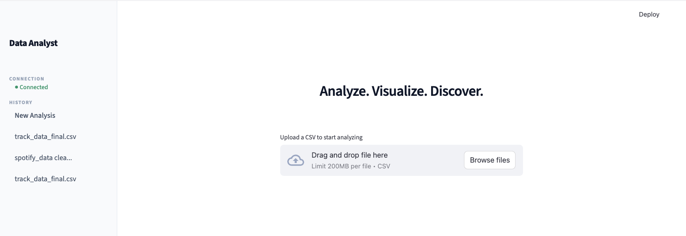

# Data Analyst Chatbot

An advanced code-execution agent built with LlamaIndex and Streamlit, designed to transform raw datasets into actionable insights through natural language.

This agent operates through autonomous code generation and execution. It analyzes your data's structure, formulates an execution plan, writes Python code (Pandas/Matplotlib), and delivers precise results alongside interactive visualizations.

## Visual Interface

### Analysis Workspace


### Visualization Gallery


### New Analysis Entry


- **Hardened Code Sandbox**: Executes Python code in a restricted environment with limited builtins and a security scanner to block malicious operations.
- **Stateless & Ephemeral Design**: No user data is permanently stored. Files and chat history exist only in memory or temporary directories that are wiped on session end or browser refresh.
- **Intelligent Dataset Profiling**: Provides deep architectural summaries of uploaded CSVs, including schema details and statistical overviews.
- **Multi-turn Contextual Chat**: Maintains full conversation state within the current session, enabling complex, follow-up analytical queries.
- **Modern Chat Interface**: A streamlined, chat-centric experience with an intuitive "plus" upload system and refined sidebar navigation.

## Technical Architecture

- **Orchestration**: LlamaIndex Workflows (Event-driven asynchronous execution)
- **Intelligence**: Google Gemini 2.0 Flash (Reasoning and Code Generation)
- **Frontend**: Streamlit (Reactive UI with custom CSS polishing)
- **Data Engine**: Pandas for data manipulation, Matplotlib/Seaborn for visualizations

## Project Structure

```
data_analyst_chatbot/
├── data_analyst_chatbot/          # Main package
│   ├── __init__.py                # Package initialization
│   ├── app.py                     # Streamlit frontend (entry point)
│   ├── workflow.py                # Workflow implementation
│   └── utils/                     # Utility modules
│       ├── __init__.py
│       └── data_loader.py        # Data loading utilities
├── docs/                          # Documentation screenshots
├── requirements.txt
├── README.md
└── run_app.sh                     # Launch script
```

## QUICK_START

### Prerequisites

- Python 3.10 or higher.
- A Google Gemini API Key.

### Installation

1. Clone the repository and navigate to the `data_analyst_chatbot` directory.
2. Install the required dependencies:
   ```bash
   pip install -r requirements.txt
   ```
3. Create a `.env` file in the project root and add your API key:
   ```env
   GOOGLE_API_KEY=your_gemini_api_key_here
   ```

### Execution

Launch the application using Streamlit:
```bash
streamlit run data_analyst_chatbot/app.py
```

Alternatively, use the provided helper script:
```bash
bash run_app.sh
```

## Privacy and Security

This application is designed for maximum privacy and platform security:
- **Zero-Persistence**: No data is permanently stored on the server. Uploaded files and session state are managed in ephemeral temporary directories.
- **Execution Sandboxing**: Python code generated by the agent is executed with a restricted set of `__builtins__` and a whitelist of libraries (`pandas`, `matplotlib`, `seaborn`, `numpy`).
- **Malicious Code Detection**: A scanner automatically blocks code containing sensitive keywords or patterns (e.g., `os`, `subprocess`, `socket`).
- **Isolation**: Each browser tab is a completely fresh, isolated session. Refreshing the browser instantly wipes all data from the current workspace.

Upload a CSV directly in the chat interface to begin your analysis.
